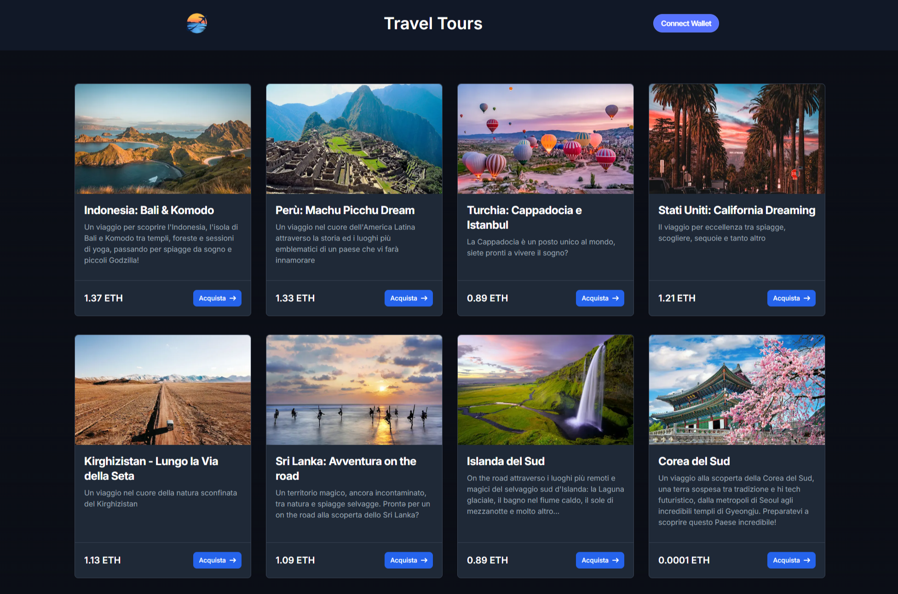

# StartToImpact: [Typescript, React e Web3 - Travel](https://web3-dapp-travel.vercel.app)

[](LICENSE)


[](https://ethereum.org/)

## Descrizione

Benvenuti nell'applicazione decentralizzata (DApp) sviluppata per promuovere viaggi consapevoli e sostenibili. Questa piattaforma permette agli utenti di esplorare e acquistare pacchetti viaggio con un impatto ambientale ridotto, utilizzando Ethereum (ETH). Gli utenti possono connettere il proprio wallet tramite estensioni browser, applicazioni per smartphone, o registrandosi tramite email o social media. Una volta scelto il pacchetto desiderato, è possibile finalizzare l'acquisto con una transazione sicura e sostenibile direttamente sulla blockchain di Ethereum.

### [Presentazione](https://www.canva.com/design/DAGPT-iTX_c/UyhXJluKCee8yBLa6gpWNw/view?utm_content=DAGPT-iTX_c&utm_campaign=designshare&utm_medium=link&utm_source=editor)

<div align="center">
  
</div>

## Utilizzo 🌐

1. **Collegamento Wallet:**

   - Visita la homepage e clicca su "Collega Wallet".
   - Scegli il metodo di collegamento preferito: estensione browser (es. MetaMask), app mobile o registrazione via email/social.

2. **Esplora i pacchetti:**

   - Sfoglia la galleria dei pacchetti di viaggio disponibili.
   - Scegli un pacchetto da acquistare.

3. **Acquisto:**
   - Premi il pulsante "Acquista" sulla pagina del pacchetto scelto.
   - Conferma la transazione tramite il tuo wallet.
   - Dopo la conferma, il pagamento sarà registrato sulla blockchain e riceverai i dettagli del tuo viaggio.

## Installazione

1. Clona il repository sul tuo computer:

```bash
git clone https://github.com/lim-haru/web3-dapp-travel.git
```

2. Entrare nella directory del progetto

```bash
cd web3-dapp-travel
```

3. Installare le dipendenze

```bash
npm install
```

4. Crea le variabili ambiente nel tuo sistema o crea un file nel root del progetto chiamandolo ".env.local" e aggiungi le seguenti variabili(Guida compilazione variabili):

```
NEXT_PUBLIC_WC_PROJECT_ID=id_del_progetto_walletconnect
NEXT_PUBLIC_IPFS_GATEWAY=dominio_gateway_ipfs
NEXT_PUBLIC_CRYPTO_PAYMENT_ADDRESS=address_del_wallet_dove_ricevere_i_pagamenti
```

5. Avviare l'applicazione

```bash
npm run dev
```

6. Apri il browser e vai all'indirizzo: [localhost:3000](http://localhost:3000)

## Tecnologie Utilizzate

<div align="center">
  
  
  
  
  
  
  
  
</div>

## Licenza 📄

Questo progetto è sotto licenza MIT. Vedi il file [LICENSE](LICENSE) per maggiori dettagli.
